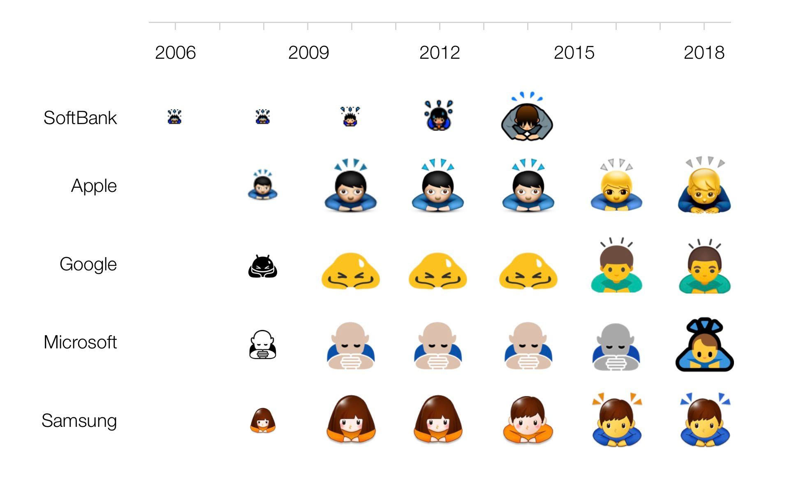
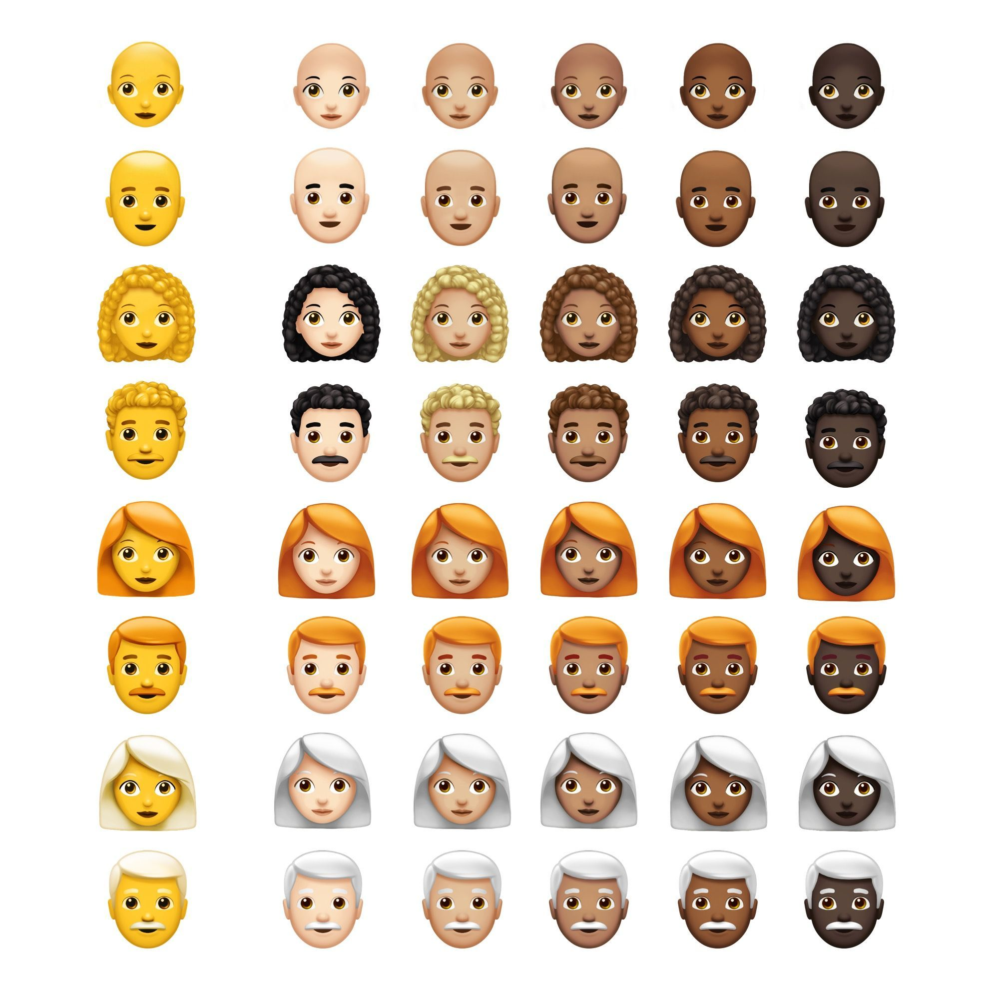

想要正常的阅读本文，要求系统版本大于 iOS 12.1，或者 Android O。

## 101

大多数 Emoji 的 code 是大于 0xFFFF 的，也就说他们不位于 Unicode 的基本零平面上。在我看来，这主要的是差别是

首先 Emoji 是字体不是图片，在 Apple 的系统里由 Apple Color Emoji 字体支持。虽然内部很可能是一种位图格式（不是矢量），但是在它呈现出来的时候我们会认为它是字体。

世界 Emoji 日是每年的 **7⃣️🈷️🔟7⃣️**，这是因为苹果在 2001 年发布 iCal 的日子就是这一天，而相对应的就是 日历 📅 上的日期。

最初的 471 个 Emoji 是专门为了日本用户提供的，因为日本早期的手机里就内置了 emoji，而 Apple 的目标也是兼容软银的。但是不同的厂商的 emoji 不一样，也可能不相互兼容。这样就导致不同手机在短信沟通的时候可能无法显示对方的 emoji。这样看来，Apple 也算是统一了 emoji 的市场。



这里有一篇文章，介绍了[Emoji 十年的变化](https://blog.emojipedia.org/apple-emoji-turns-10/)

## 肤色

Emoji 或者说 Unicode 其实是支持合成的，比如几个字符连起来就能成为一个新的字符，最为常见的就是肤色了。

🏻🏼🏽🏾🏿 在 Unicode 7 中引入了五种肤色字符，越后面的越黑。
这五个 emoji 的 code 分别对应 _0x1f3fb, 0x1f3fc, 0x1f3fd, 0x1f3fe, 0x1f3ff_。

支持肤色的 emoji 和 肤色的 emoji 放在一起，就能形成一个有色人种的 emoji 。
就比如一个黄皮肤男人 👨 [^ 0x1f468] 和白色的 🏻 组合在一起，就变成了白人 👨🏻。值得一提的是，这里的默认颜色并不代表是**黄种人**，而是特意使用一种不像任何人种的颜色，其实就是普通 emoji 小黄脸的颜色。

在 JS 中可以这样合成

```js
'\u{1f468}' + '\u{1f3fb}';
```

接着除了肤色之外，emoji 还能组合 👩‍👩‍👧‍👧

## 组合

要想让 emoji 能够组合，需要在想组合的字符之间插入 _0x200d_。这是一个不可见的控制字符，打印出来就类似空字符串，可以把它理解成一种神奇的胶水字符。

👨👩👧 这三个可以合成 👨‍👩‍👧，也就是一个男人，一个女人，一个小孩组成的家庭。

但是这里一个有意思的点是，它不仅仅支持黄皮肤的 emoji 合成，如果你尝试把 👨 改成 👨🏻 的话，也是可以得到 👨‍👩‍👧。

再举个例子，🏳️‍🌈 你猜是由哪些 emoji 组成的？🏳️ + 🌈

那么 🏴‍☠️ 呢？🏴 + ☠️

接着，在 unicode 11 中又支持了发型，目前对应 iOS 12.1 的版本。它可以在肤色的基础上，赋予人发型。举个例子，这个 emoji：👩🏻‍🦳
就是由一个 👩 + 🏼 + 🦳 组成。
发型一共有几种，分别是：
Red Hair 🦰, Curly Hair 🦱, Bald 🦲,White Hair 🦳
对应到 `0x1f9b0—0x1f9b3`

所以你希望一个秃头黑人的话，就可以这样。这里指的说明会的一点：**肤色和生物之间并不需要 0x200d**

```js
'\u{1f468}\u{1f3ff}\u{200d}\u{1f9b2}' 👨🏿‍🦲
```

放上一张全家福



而让我觉得骚的是，除了人支持肤色外，还有一些器官也支持了。🦵*0x1f9b5*🦶*0x1f9b6* 都能加上肤色。
另外还有新的 emoji：🦸‍♀️ 🦸‍♂️，它是由基本的超级英雄 🦸(0x1f9b8) 加上性别符号 ♂️ _\u{2642}\u{fe0f}_ ♀ ️*\u{2641}\u{fe0f}*。另外，除了超级英雄外，还有很多支持性别区分的 emoji，比如超级坏蛋 🦹。

还有 🧙🧚🧛🧜🧝🧞🧟🧗🧘 这些都支持和性别组合。
真的丧心病狂啊！

## Unicode 12.0

在明年的 12.0 里面还会包括很多更有意思的内容。它偏向于 accessibility，所以多了很多和这方面有关的元素。比如**坐着轮椅的白色男人**，助听器等等。也多出了手牵着手的 emoji，像这种白色的女人和黑色的男人握手 [👩🏻‍🤝‍👨🏿](https://emojipedia.org/woman-and-man-holding-hands-light-skin-tone-dark-skin-tone/)。除了异性之外，同性也有对应的 emoji，为 🌈 们提供骄傲。

需要注意的是，握手如果是异性的话，左边的是女性右边的是男性，却没有左边是男性右边是女性的，这可能是出于对女性的尊重吧。然后再加上不同肤色的排列组合的话，就会多出 (!@#¥ 自己算吧 🌚）个看上去没上卵用的 emoji。

关于更多 Emoji 12 的介绍，可以查看[这篇文章](https://blog.emojipedia.org/230-new-emojis-in-final-list-for-2019/)，这里面也出现了我提到的手拉手 emoji 的集合，让世界充满爱。
