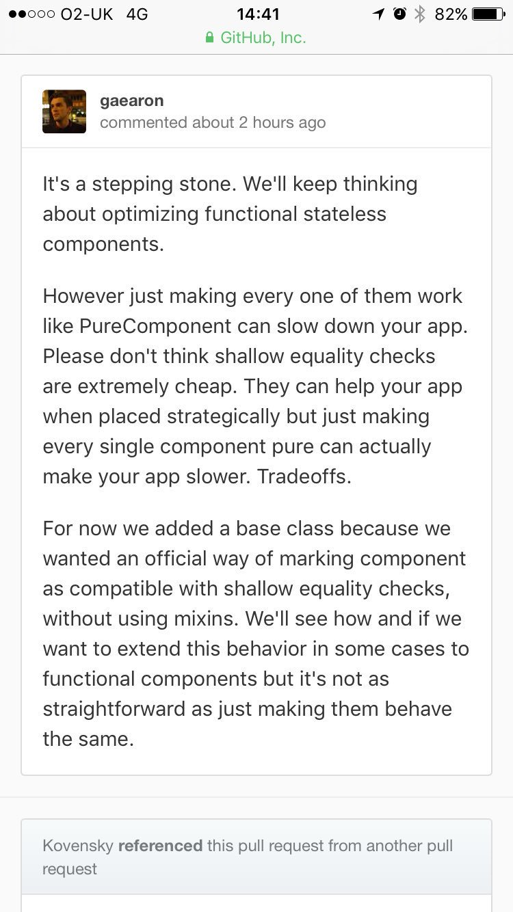

这篇文章有点标题党, 其实主要要强调的是 **到处使用 PureComponent 是不对的**.

## 和 Component 的区别

其实, `PureComponent & Component` 的区别不大, `PureComponent` 自己实现了 `shouldComponentUpdate` 方法, 大概的实现类似于

```js
shouldComponentUpdate(nextProps, nextState) {
	return !shadowEquals(nextProps, this.props) || !shadowEquals(nextState, this.state);
}
```

现在有一个能组件, 能在不需要更新的时候, 自动帮我们做出这个判断, 不是很好嘛?
先想象一个很常见的场景. 比如下面的界面


假设上面的搜索框和下面的内容是**同胞组件**, 理想情况下, 每一次修改输入框的值都会调用 `setState`, 也就会导致整个页面重新渲染. 对于下面庞大的组件来说, 显然是很浪费的.
如果让下面的组件继承 PureComponent 的话, 很大程度的解决了这个问题.

## shadowEquals 不是免费的

这仅仅只是 PureComponent 美好的一面，我们在享受这种美好的时候，很容易被忽略的它的副作用：**每一次 setState 所有的组件都会进行一次 shadowEquals。**
换句话说，在期望它更新的时候，这些计算都是不可避免的。我做了一个 [demo](https://codesandbox.io/s/v6y1m1yjk7)，仅仅一个组件，它的 props 是一个有 3000 个字段的对象, 并且保证真正需要更新的 prop 会在最后才被比较到，将 shadowEquals 的优化完全抵销。

可以看到，通过 `componentDidUpdate` 每次更新花在 shadowEquals 的时间, 在我的 16 年 13 寸 MacBook Pro 上平均每次需要花费 1.5ms. 当我尝试降低速度四倍的时候, 你猜怎么着? 平均花费的时间达到了 7ms. 可能你会觉得 7ms 似乎也不是多恐怖, 而且我这里是故意捏造了一个 3000 字段的对象.
不过, 在现实情况中, 大量的组件在一次 _reconciliation_ 后, 发生 re-render, 它们的 props 和 state 的字段长度之和应该有 3000 的数量级.

再考虑下动画, 要达到 60FPS. 至少要求每一帧能在 17ms 之内运行完毕, 那么仅仅一个 `showComponentUpdate` 方法就会占据 7ms 的时间, 剩下的解析代码, 生成 V-DOM, DOM 的一系列更新操作要在 10ms 之内完成的话, 实在太难. 所以很容易出现动画掉帧的情况.

这里还有几个佐证: Reactjs 团队的成员建议不要大量使用 PureComponent 的警告 ⚠️.
这个 [hacknew](https://news.ycombinator.com/item?id=14418576) 的帖子的作者, 发表了大致的观点:

> 不要到处使用 PureComponent, 如果我们建议这种行为的话, 为什么不让这是默认选项呢?
> 那么 15.3 推出 PureComponent 的原因到底是什么呢?

[Dan Abramov](https://twitter.com/dan_abramov) 在 Github 中解释了这个原因

> We added a base class because we wanted an official way of marking component as compatible with shadow equality checks, with using mixins.

下面是这段话的完整截图. 这段话具体出自哪个 issue 我并不清楚, 这个截图其实是由 Dan 在 Twitter 中发出来的. 这个[推](https://twitter.com/dan_abramov/status/759383530120110080)发布于 2016 年 6 月底



接着在 2017 年 1 月, Dan 又发了[一条](https://twitter.com/dan_abramov/status/820668074223353858) 来强调这个观点. 所以, 可以确定的是, **任何地方都是用 PureComponent 被认为是有害的.**

## 降低可读性

接下来, 还有一个问题. 比如平时有一个组件 `Button`, 我们想给它加一个 `style` prop, 如果仅仅只是加一个 `margin` 的话, 我们可能会这样写

```jsx
<Button style={{ marginTop: 20 }}>This is a Component</Button>
```

这没有问题, 对于一个小小的需求, 这里用这种写法其实在性能上问题不大, 虽然 style 在每次 render 的时候都是一个新的对象, 但是其实没我们想象的那么糟糕. 因为在普通的 Component, 如果没有特殊处理 `shouldComponentUpdate` 的话, 这个组件肯定是会重新被 render, 生成一个 VDOM 的, 在 VDOM 转化为 DOM 的过程中, 因为 style 的内容没有变化, 所以最后不会更新 DOM, 这个操作的损耗并不大.
但是如果 Button 是 PureComponent 的话, 那么这样写的话每次都会带来一次无用的 `shadowEquals`. 所以要写成

```jsx
const style = { marginTop: 20 };
<Button style={style}>This is a PureComponent</Button>;
```

这样的话, 确实会有一些好处. 因为 style 作为 props 没有变化, `shouldComponentUpdate` 会返回 false, 连 render 都不会发生, 在性能上**可能**会有点提升. 可是每一次这种小小的变化, 都需要想一个名字, 作为一个常量真的不痛苦吗?

这个例子可能还不够突出, 思考一下现在正火的 `render props`, 本来一个普通的 Component, 可以写成

```jsx
<Link
	render={props => <AnotherComponent {...props} />
/>
```

但是如果 Link 是 PureComponent 的话, 要改成

```jsx
const render = props => <AnotherComponent {...props} />
...
<Link render={render} />
```

如果是这样真的更好吗? 我们为什么要把一个 render 放在离 Link 那么远的地方? 这对于理解代码显然是不够的, 这让一个本来应该直观的 render 变得不那么直观.
在 React 文档的 [render props](https://reactjs.org/docs/render-props.html#caveats) 一章有对应的介绍.

## 结论

所以该在什么时候使用 PureComponent 呢? 一个通用的建议是: 在一个 List 有关或者 Form 相关的组件外部包一个 PureComponent, 这样可以起到不错的效果. 如果使用了 `recompose` 的话, 可以很容易完成这个任务 `pure(<MyListComponent />)`
