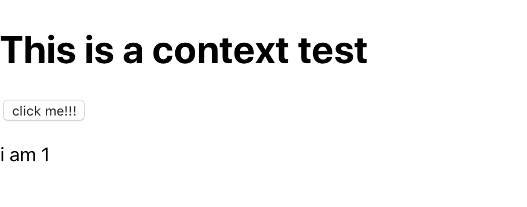

收集一些不为人所知的，React 的细节问题。帮助自己理顺 React 内部深层的逻辑。

## Synthetic Event 和 DOM Event 同时出现的问题

首先解释下，为什么 React 会有 Synthetic Event 这个概念。主要两个原因

1. 13 年的时候，浏览器发展比如今天，不同的浏览器在同一个概念上，可能会有不同的 API，另外那个时候还需要兼容 IE8。
2. 针对大量创建 Event Object 的场景，有一个优化。这就诞生了 Event Pooling 这个概念。换句话说，在 React 中不需要之前的**事件委托**

而 React 为了实现 Synthetic Event，是通过将所有的 `onXXX` 事件注册在 `document` 上来实现的。所以这就在某些十分特殊的场景下，会产生一些问题。看下面代码，或者 [sandbox](https://codesandbox.io/s/v1m3o069j7)

```jsx
import React, { useCallback, useEffect } from 'react';

const App = () => {
  const handleClickOnDocument = e => {
    console.log('handling event on document');
  };
  const handleClickOnWindow = () => {
    console.log('handling event on window');
  };
  useEffect(() => {
    document.addEventListener('click', handleClickOnDocument);
    window.addEventListener('click', handleClickOnWindow);
    return () => {
      document.removeEventListener('click', handleClickOnDocument);
      window.removeEventListener('click', handleClickOnWindow);
    };
  }, []);
  return (
    <div onClick={() => console.log('handling event on div')}>
      <button
        onClick={e => {
          e.stopPropagation();
        }}
      >
        Click Me
      </button>
    </div>
  );
};

export default App;
```

如果点击那个 button 会发生什么？在传统的 DOM 代码中，很明显什么都不会输出。但是在 React 中，我们会得到

```
handling event on the document
```

一起来分析下原因

### 原因

首先，在 button 被点击后，`stopPropagation` 起作用，使父组件 div 的 _onClick_ Synthetic Event 不会被调用。另外，原生的 DOM 事件也会被触发。因为 `stopPropagation` 不同于 `stopImmediatePropagation`，所以 `document` 上的事件还是被调用。又因为 _window_ 是 `document` 的父级，所以就不会继续运行。

原因已经很明显了，但是我们可以更进一步。如果在 div 上有一个 native DOM 事件，那么在**点击 button 后，到底是 button 的 Synthetic 事件先运行还是 button 的 native 事件？**

```jsx{1,10-13,17,21,25,28}
import React, { useCallback, useEffect, useRef } from 'react';

const App = () => {
  const handleClickOnDocument = e => {
    console.log('handling event on document');
  };
  const handleClickOnWindow = () => {
    console.log('handling event on window');
  };
  const handleClickDiv = () => {
    console.log('handling event on div with ref');
  };
  const div = useRef();
  useEffect(() => {
    document.addEventListener('click', handleClickOnDocument);
    window.addEventListener('click', handleClickOnWindow);
    div.current.addEventListener('click', handleClickDiv);
    return () => {
      document.removeEventListener('click', handleClickOnDocument);
      window.removeEventListener('click', handleClickOnWindow);
      div.current.removeEventListener('click', handleClickDiv);
    };
  }, []);
  return (
    <div ref={div} onClick={() => console.log('handling event on div')}>
      <button
        onClick={e => {
          console.log('button');
          e.stopPropagation();
        }}
      >
        Click Me
      </button>
    </div>
  );
};

export default App;
```

直觉上觉得是会打印出

```
button
handle event on div with ref
handling event on the document
```

但根据上面的说法， Synthetic Event 会绑定在 document 上，那么根据**冒泡**的顺序，div 的 native 事件会先运行。可以得出下面结论

```
handling event on div with ref
button
handling event on document
```

### 结论

因为 Synthetic Event 会将事件绑定在 document 上，从而导致在和 native dom 事件有一定逻辑关联的时候，出现一些不符合直觉的问题。这种场景下，一定需要小心。

### 相关链接

- [Event listener attached to document will still be called after calling event.stopPropagation() · Issue #12518 · facebook/react · GitHub](https://github.com/facebook/react/issues/12518)
- [SyntheticEvent – React](https://reactjs.org/docs/events.html)

---

## Context 的更新，会更新 ✨ Provider ➡️ Consumer 之间所有的组件么

这个问题提出来的依据主要是，`setState` 在 React 中是会**一定会带来更新的**，除非设置了 `memo` 或者 `shouldComponentUpdate` 这些优化措施。换句话说，一般情况下，每次 Context 中 value 的更新，必定伴随着一个 setState 的过程。而这个过程必定导致含有 `<Context.Provider>` 的组件往下更新，也就让我们无法观察到这个过程的更进一步的细节。

如果想要探究这个问题的话，需要三个组件，分别被称为 App, Foo, Bar。

App 是父组件，它的 `render` 中就返回了包含 Provider 的代码。

Foo 组件是这个 Context 的消费者，它通过 Provider 拿到对应的展示内容。

Bar 则是两个组件中的中间层，它的作用就是承接 Foo 和 App。同时它的 `shouldComponentUpdate` 会设置为 **false**。

借助 Hooks，有下面的实验 🧪 代码。

```jsx{11}
import React, { useContext, memo, useState, useCallback } from 'react';

const FooContext = React.createContext(1);

const Foo = () => {
  const foo = useContext(FooContext);
  console.count('foo');

  return <p>i am {foo}</p>;
};
const Bar = memo(() => {
  console.count('bar');
  return <Foo />;
});

const App = () => {
  const [value, setValue] = useState(1);
  const addValue = useCallback(() => setValue(value + 1));

  return (
    <>
      <h1>This is a context test</h1>
      <button onClick={addValue}>click me!!!</button>
      <FooContext.Provider value={value}>
        <Bar />
      </FooContext.Provider>
    </>
  );
};
```

界面很 简单

通过点击 _click me_ 那个 button，就能看到 /i am / 的变化。同时注意 Foo 和 Bar 中都有一个 `console.count` 用来观察这个组件是否重新渲染。
得到的结果就是，**foo 会随着每次点击都打印，而 bar 不会**。如果将 memo 移除的话，每次 bar 也会被打印出来了。

最后结论就是：**Provider 的更新不会带动 Consumer 之间的组件更新**。

### 顺便一提

当然，其实这个问题通过推断就能得到结果的。因为新的 Context 带来的一个重要特性就是**即使 shouldComponentUpdate 返回 false，子组件也会被更新。**

如果我们把上面的 Foo 和 Bar 合成一个

```jsx{3,4}
const Bar = memo(() => {
  console.count('bar');
  const foo = useContext(FooContext);
  return <p>i am {foo}</p>;
});
```

也是一样的效果。
