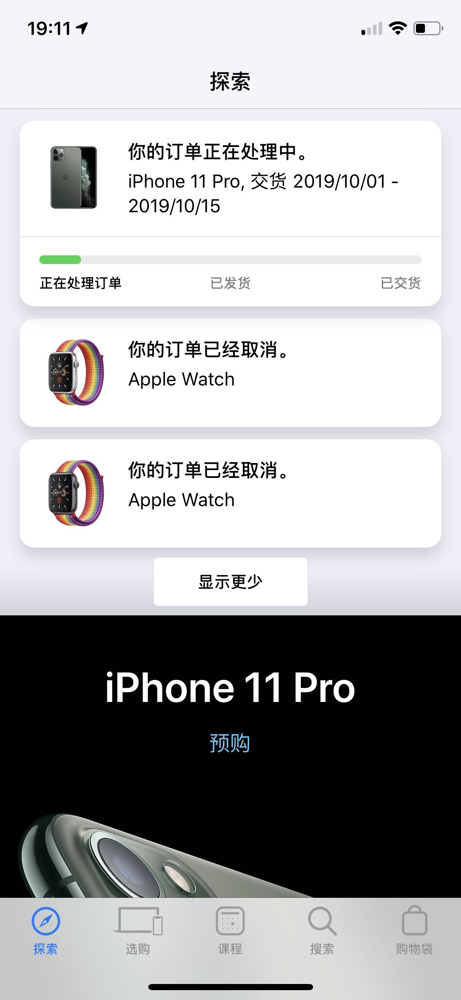

虽然 iPhone 在每次发布会前都会被大大小小的曝光：**外观，三摄，Logo 居中**等等看上去让人很失望的改变，而在看了直播发布会后也真的同样，很失望 😣。但主要原因还是我的听力不太行，所以发布会的时候会忽略很多细节。真的认为这次单单就是加了个颜色，屏幕稍稍好了点点，以及摄像头翻新。抱着发布会看都看了，总要买点啥（体验下最先进的技术）的心态，所以我最初是想只买一个 Apple Watch series 5，毕竟 _Always on_ 看上去还是很黑科技的。

可是等发布会过了几天，自己再到官网好好审视这次 iPhone 11 Pro 的文案，以及相比 iPhone XS 的对比，发现了很多我发布会上没注意到的东西。

1. 工艺升级。双离子交换工艺成就的亚光质感并且更耐操的玻璃后盖
2. Logo 居中，但是并不知道是因为美观问题还是支持了无线充电，这个没有提到
3. 升级的前置摄像头，更快的神经网络架构意味着更快的 Face ID 解锁，**后文还提到了前置摄像头变成广角，解说角度会更多**
4. 防水能力提升。其实这个对我来说，还是有点用的，从 iPhone 7 开始，我就喜欢用水洗手机了～
5. 屏幕对比度提升一倍，黑得更黑，亮得更亮。支持 HDR 的视频效果贼棒。而关于杜比音效和 HDR 10 的效果，在国内的视频网站是很难感受到，Netflix 又挺贵的，寄希望于看看 Apple TV+ 的效果
6. 3D Touch 没了，换来了更厚更重，更强的续航 🌞
7. Space Audio 和杜比全景声。我原以为 XS 支持了，结果官网说的只是**更宽广的立体声**
8. 双卡 ✨
9. U1 芯片，目前只是提升 AirDrop 的能力

这其中最让我把持不住的，有三点。亚光质感带来的手感提升，屏幕的提升和外放能力的增强。
关于 OLED 和 LCD 屏幕效果的差别，在平时可能不那么容易体现，但是如果在一个关上灯的房间里，你打开微信读书，调到夜间模式。再注意到 iPad 和 iPhone 的区别，就能体会到 OLED 的黑色有多么的深邃 🌚 （有可能微信没有给 LCD 屏幕黑色）。这种感觉在我第一次察觉到后，就再也不想回到 LCD 了。
所以即使这次 iPhone 11 也很良心，包括摄像头，屏幕，质感外也都得到了提升，但就因为这个屏幕我还是放弃了。

另外，苹果还将为 Pro（还是 A13 都行？） 带来了一个被称为 Deep Fusion 的拍照技术，大概就是通过机器学习让算出图片放大后的样子。这个似乎华为和谷歌都做过了，而且在官网也没看到相关预告，仅仅只是在发布会中提到了一下。

我相信这一代的升级，相比去年对比 iPhone X 的升级，肯定还是有一大波消费者「真香」的，毕竟新配色，新外观。而且我在对比了 iPhone XS 和 iPhone X 的区别后发现，XS 的改动更加不值得一提( ･᷄ὢ･᷅ )

而关于是否支持 5G，这就是个伪命题。本来技术就没准备好，5G 的标准也在今年 7 月份才最终制定完毕，而且没有 IOT 的 5G 除了网速看上去稍微快点，也不会一下子就有太大的改进。再加上基站的数量并没有提升，导致最初天线去获取 5G 所需要的功率可能要更高，也就意味着更加耗电。这就让价格敏感用户们，抓着这个他也不知道到底是啥东西的 5G 不放，因为他们希望这部手机至少能用到三年吧～

所以最后掂量了一下手中的 XS，越看后背的双摄越觉得丑。然后又想到这次升级 iOS 13 搞得我的电池消耗非常大，一天一天都顶不住了。看了下 Trade-in，可以卖个 3300 🌞

[iPhone 对比](https://www.apple.com/cn/iphone/compare/)

## 补充

最近看了些评测，发现相机的提升实在太强了。首先是夜间模式的能力大幅提升，这个相信大家都已经看过样图和赞美的文章了。

另外还有几个被广为称赞的细节：
首先苹果是把三个相机同时打开并实时取景的，在你拍一张照片的时候其实是拍了至少三张不同焦距的照片，并保存下来，你在编辑相片的时候可以随意决定是否切换成其他的焦距。这个可以在相机设置中决定是否关闭

第二，前置摄像头变成了广角。这意味着和 XS 的相比，脸看上去不会那么大了，Face ID 的能力也肯定会更强。只不过竖屏情况下，苹果通过照片的裁切让拍照的时候不会显得离镜头太远。一旦你这个时候将手机横屏，就能明显地看到整个视角的调整。不过目前看来，这个视角调整的动画还比较生硬

