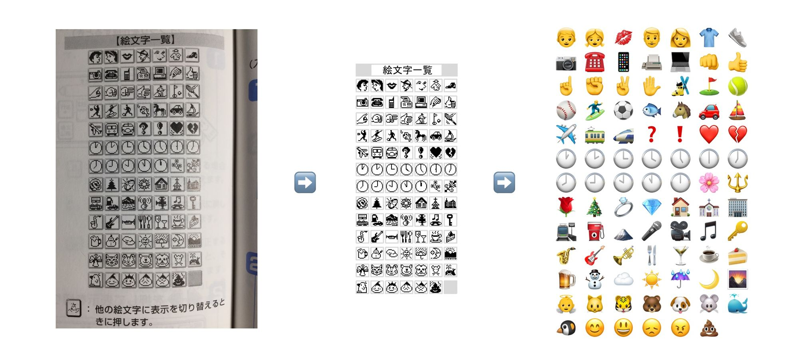
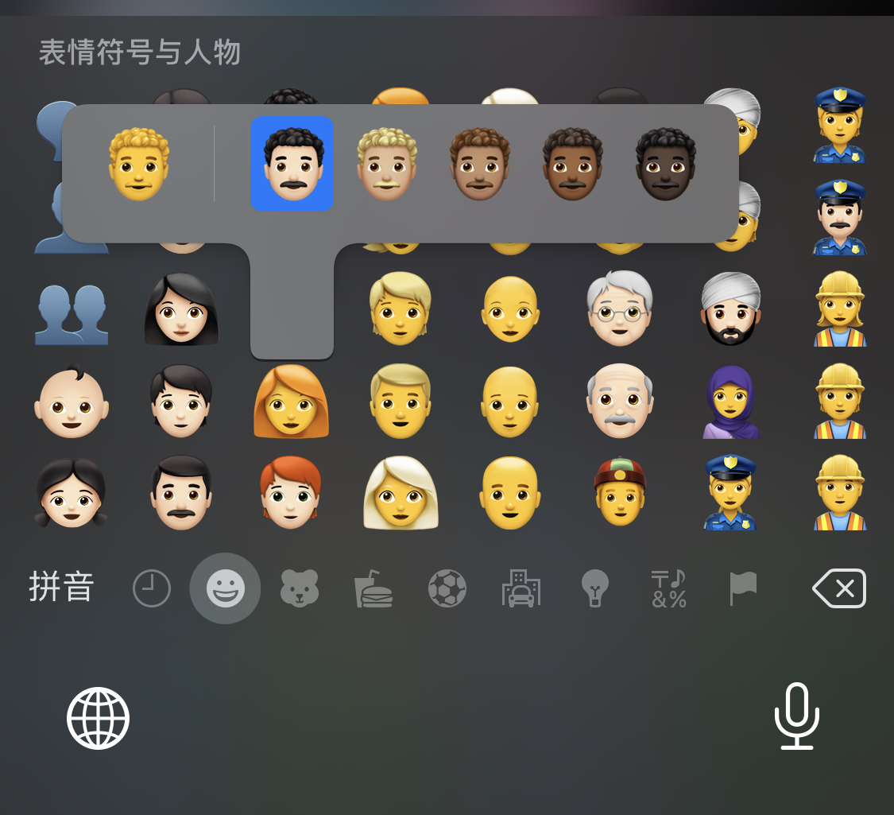

之前写过一篇关于 [emoji 有趣的小知识](../emoji)，随着自己对 emoji 相关有更多的了解，并看了一点规范后，打算从更全面的视角和专业词汇，来讲述 emoji 的相关知识。

本文尝试讲解 Emoji 的一些有趣的冷知识，来帮助我们理解这个全世界通用的语言。
在开始之前，先抛出几个问题：
1. 如何翻转 Unicode 字符串
2. 如何正确的给字符串计数

如果你能回答出上面这些问题，那么恭喜你，你对于 Emoji 的掌握已经超越了大部分人，但是呢，本文会尝试讨论很多你不知道的细节，Emoji 有多有趣，又有多坑。

从下面开始👇🏻，为了最好的阅读体验📖，请打开你的浏览器🌍，跟我写点 JavaScript🧑🏻‍💻，一起看看 Emoji 的世界🚗。

## 编码
因为 Emoji 隶属于 Unicode 规范，所以大多数 Emoji 都有对应的码位（code point），就如同 `A` 在 _ASCII_ 中的码位为 `65` 一样，😏 在 Unicode 中的码位就为 `1f60f`。但是如果你尝试在像 JS 这样的语言中，测试 `'😏'.length` 会发现返回的 2，这是因为 JS 从 ES6 开始，采用了 UTF-16 来实现 Unicode。而 UTF-16 属于一种变长实现，它会根据码位决定是占用 2 字节还是 4 字节，也就是 1 个 code unit 还是 2 个。因为 `1f60f > ffff`，自然编码它就需要 2 个 code unit。所以在 JS 中返回的就是 2。
是否存在返回的 1 的 Emoji 呢？答案是没有。虽然你去查 [Emoji list](https://unicode.org/emoji/charts/full-emoji-list.html#arrow) 的的时候发现，这里明明有一些 code point 小于 `ffff` 的码位呀，比如 ⬆️。
可是一旦你尝试输入 `'⬆️'.length` 的时候，发现还是输出 2。


为了解答这个问题，需要先介绍点 Emoji 的历史

## 起源
Emoji—絵文字，其中 e 是 绘，moji 代表文字的意思，最早起源于日本的 20 世纪 90 年代，由软银推出。



接着的事情大家都知道了，iPhone 面世，为了占领日本市场（我有一亿人需要用 Emoji 呢），就合作将 Emoji 弄了进去。并随着 iPhone 的热度提升，Emoji 也开始世界范围内大火 。接着 Emoji 进入 Unicode 的标准，**大部分** Emoji 都有了自己的码位，成为一个事实上的标准。这样消费者也不用担心 iPhone 手机发的 Emoji 安卓看不到了（不考虑系统版本的问题，事实上还是可能出现这种情况，后面会提到）

OK，那么这和我们上面的问题有啥关系呢？需要注意的点是，这些被兼容的 Emoji，其实最早只是文字形式，而并不是我们现在看到的这种图片形式。为了不浪费码位，所以采取了一种比较「奇怪」的方式来获得 图片 形式—Variation Selector。Unicode 中定义了很多不同版本的 Variation Selector，我们只要记住对应 Text 的版本是 15，对应 Emoji 的版本是 [16](https://emojipedia.org/variation-selector-16/)，后文将分别简写为 VS-15(_0xfe0e_)，VS-16(_0xfe0f_)。所以这就解释了上面的 ⬆️ 为什么输出的是 2。

因为在通过 Emoji 键盘或者自动补全被输出的时候，它是 _2b06_ 和 _fe0f_ 的组合，才成为了你看到的图片形式。如果直接编码 _2b06_ 或者 _2b06 fe0e_，就会看到它的文本形式：⬆︎。

尽管 Unicode 建议使用 Text 形式作为默认的形式（这个也有定义，旗帜默认就是图片形式），意味着 _2b06_ 应该渲染成文字形式。但是 iOS 可能是为了秀自己的 Emoji 字体，并没有遵守这个标准。如果想在 iOS 在看到文字形式的字符，必须手动将 _fe0e_ 编进去。否则在 iOS 中你看到这个符号还是 Emoji 形式⬆。

## 旗帜问题
接着根据这个 VS-16，让我们来看看 iOS 10 时期出现的一个 [bug](https://www.instapaper.com/read/1288315176)

> 简单点讲就是一旦收到某人发送过来的含有”🏳️‍0🌈”的短消息，将会导致设备死机，需要重启手机才能解决。
想要解释清楚这个 bug，先要了解一下旗帜的规则。

**我们先记住一个原则，Unicode 非常抠门，为了节省码位它们什么事情都干得出来。**
你想想，世界上，那么多国家。国家内部可能还有一些地区，这些地区也有自己的旗帜。如果一个个编码显得过于奢侈和复杂。举个例子，假设 Unicode 先给国旗放 500 个码位，然后现有国家用掉了 300 个。未来又有一些奇怪的旗帜也想进去凑数，但这样可能导致剩下的 200 个也不够放，那又需要临时开一个区域放新的码位。针对这个问题，Unicode 也提出了一种解决方案。

1. 最简单的旗帜：🚩🏳️🏁🏴🎌。这些旗帜都有独立的码位，不过为了兼容早期，可能会跟着一个 VS-16。
2. 国旗—🇨🇳🇺🇸🇬🇧。
3. 地区旗帜—🏴󠁧󠁢󠁥󠁮󠁧󠁿🏴󠁧󠁢󠁳󠁣󠁴󠁿。
4. 特殊旗帜—🏳️‍🌈🏴‍☠️

### 国旗
它们是由专门的 [Regional Indicator Symbol(RIS)](https://en.wikipedia.org/wiki/Regional_Indicator_Symbol) 组合而来，它们有 26 个，从 A 到 Z，码位分别是从 _1f1e6_ 到 _1f200_，光是两两组合就有 26 * 26 中方案。打开控制台输入:
```js
Array.from(
   { length: 26 },
   (_, i) => String.fromCodePoint(0x1f1e6 + i)
).join(',')
```
就能看到所有的字符。为什么要用 `join(',')` 而不是 `join('')`？试试看😏
所以🇨🇳就是 🇨 🇳 放在一起，同样的🇺🇸的就是 🇺 🇸

如果你对这种两个字符放在一起，会变成新的字符的特性不是很熟悉的话，可能会认为这是 Emoji 的特性，但其实这种被称为 [Combining Character](https://en.wikipedia.org/wiki/Combining_character) 的技术很早就已经被支持。最常见的使用场景就是拉丁语和音调符号的组合。比如 _é_ 有一个单独的码位 _e9_，但是它也可以由 _e_ 和 _´_ 组合，它们的码位分别是 _65_ 和 _301_。所以如果你在浏览器输入 `\u{65}\u{301}` 也能得到 é。不过需要注意的是，像 JS 这种相对落后的语言并不会认为 `\u{65}\u{301} === \u{e9}` 是 `true`，反观 Swift 这种相对现代的语言，则对这个特性有了良好的支持。

### 地区旗帜
我不太懂政治，不太清楚像英格兰和苏格兰这两个地方不是国家（世界杯都是两支队伍），但是显然它们都有自己的旗帜。这里的组合逻辑就很复杂了，首先需要一个 🏴 跟上 ISO 定义的 RIS，再跟上一个 _Cancel Tag(007f)_。像这里英格兰的 RIS 是 _GBENG_，可能是 _Great Britain EnGLand_ 的缩写。换句话说，一个🏴󠁧󠁢󠁥󠁮󠁧󠁿就占了 7 个码位，比直接写「英格兰」浪费多了🌚

### 彩虹旗
这些旗帜本质上是通过 Emoji 组合起来的。比如彩虹旗就是 🏳️+_ZWJ_+🌈，🏴‍☠️是🏴+_ZWJ_+☠️。[ZWJ（Zero Width Joiner)](https://emojipedia.org/zero-width-joiner/) 可以理解成 Emoji 胶水，用来粘合一些用于特殊意义的 Emoji，以达到节省码位的目的，它们被称之为 [Emoji ZWJ Sequence](https://blog.emojipedia.org/emoji-zwj-sequences-three-letters-many-possibilities/)。毕竟谁能知道 10 年后，我们手机里有多少个 Emoji 呢？插一句题外话，当你发现项目中 `if (result === '')`  分支怎么都不为真的时候，可能就是有人在代码里下毒了。

所以，回到我们上面提到 iOS 10 曾经的一个 bug，表面上是🏳️0🌈这种组合，但是如果在当时的系统上直接打出来这个几个符号并不会有什么问题，因为它们的对应的编码是 _1f3f3, fe0f, 30, 1f308_。而会让机器的 Crash 的信息对应的编码 _1f3f3, fe0f, 200d, 30, 1f308_—**其中多出来的 _200d_ 就是 ZWJ**。所以说，造成这个漏洞的原因可能是：_1f3f3, f30f, 200d_ 同时出现后，系统预期 _200d_ 后面的字符可以组合一个新的 Emoji。但是通过人为添加的 0，过于想当然的系统自然就 Crash 了。

接着我们继续展开 ZWJ，看看有哪些 Emoji 是基于这个来创造的。

## Emoji ZWJ Sequence
这个的使用场景除了上面提到的物体之间的组合之外，更多的还是人之间的组合。比如👨和特殊的物品组合在一起，变成了某个专业人士。👨和👩组合在一起，👨👩🧒在一起，👨👨 在一起，都能组合家庭。还有一些虚幻的人物，比如🧚‍♀️，🧟‍♀️这些，从 Emoji 12 开始，出于政治正确的目的，都将这些虚幻人物默认设置为「中性」，并通过 ZWJ 拼接 ♂️和 ♁️。最让我觉得有趣的还是爱情相关的符号：👩‍❤️‍💋‍👩 👩‍❤️‍👨。

下面我们来详细讨论这些

### 专业人员
👩‍🎤👩‍🏫👩‍🔧👩‍🎓，这三个 Emoji 对应的分别是 女歌手，女教师，**白皮肤的**女技工。根据 Emoji 的规则就是：
👩‍🎤：👩 + ZWJ + 🎤
👩‍🏫：👩 + ZWJ + 🏫
👩‍🔧：👩 + ZWJ + 🔧
👩‍🎓：👩 + ZWJ + 🎓

注意到基本共识就是 性别Emoji + ZWJ + 一个能表示该专业人员的典型物体。虽然在学校的女人不一定仅仅是老师，还可能是家长，学生，但是一个老师由 女人+ 学校组成我们很容易记忆。

其实通过这个规律我们可以看到很有意思的效果
```js
'👩' + '\u200d' + '🎤' // 👩‍🎤
'👩‍🎤'.replace('🎤', '🎓') // 👩‍🎓
```

引用 Twitter 上的一幅图：


### 虚构人物
我尝试尽量列出所有虚拟人物：

超级英雄：🦸🦸‍♂️🦸‍♀️
超级反派：🦹🦹‍♂️🦹‍♀️
法师：🧙🧙‍♂️🧙‍♀️
仙子：🧚 🧚‍♂️🧚‍♀️
吸血鬼：🧛🧛‍♂️🧛‍♀️
人鱼：🧜🧜‍♂️🧜‍♀️
精灵：🧝🧝‍♂️🧝‍♀️
妖怪：🧞🧞‍♂️🧞‍♀️
僵尸：🧟🧟‍♂️🧟‍♀️

这些虚拟人物的 Emoji 其实就有深深的政治正确在里面。首先，任何角色都有一个男性，也有一个女性在里面，特别是美人鱼还有男性这个完全忍不了 :)。但是呢，Emoji 标准更进一步，它们又多了一个没有性别的符号，这样的改动看上去似乎只是被迫与近几年平权运动的兴起，多了一个符号而已。
但是 Emoji 的组合公式也变了，相比之前女性角色是由 男性角色加上 ♂️符号，这种过于男权的表现。**现在改为一个没有性别的 Emoji +  ZWJ + ♂️或者 ♀️ 表示对应的性别组合。**

```js
[...'🧜‍♂️'].map(a => a.codePointAt(0).toString(16))
// ["1f9dc", "200d", "2642", "fe0f"] (4)
```

其实除了这些虚拟人物都有组成家庭的必要条件后，上面提到的专业人士也有对应的非性别版本，圣诞老人也有圣诞老奶奶 🤶 ，兔女郎和兔男郎 👯‍♂️ 👯。

### 爱情
一开始对爱情的定义应该挺容易的：💑，男性和女性之间出现了个❤️。公司为 👨 + ZWJ + ❤️ + ZWJ + 👩。秉承着包容的态度，Emoji 也对爱情的定义进行了扩容—👨‍❤️‍👨👩‍❤️‍👩
接着爱情的下一步就是 kiss，所以 👨‍❤️‍💋‍👨 👩‍❤️‍💋‍👩 也自然少不了。Kiss 相比爱情的 Emoji，是在❤️ 后面加了个 💋‍‍‍。嗯，interesting。

有了爱情之后，自然就会组成家庭👪

### Family
家庭最开始也挺简单的，爸爸👨和妈妈👩加上几个孩子的组合。一个👦，一个👧，一👦一👧，两个👧，两个👦，就五种。仅此而已 👨‍👩‍👦 👨‍👩‍👧 👨‍👩‍👧‍👦 👨‍👩‍👦‍👦 👨‍👩‍👧‍👧 。
公式也很简单，👨 + ZWJ + 👩 + ZWJ + 👧 + ZWJ + 👦，你可以很容易验证
 `[...'👨👩👧👦'].join('\u{200d}')`

但是不知道从什么时候开始，家庭的概念也被扩充了。有单亲家庭，有同性家庭：👨‍👨‍👧‍👦👩‍👩‍👦‍👦👨‍👧。当然公式相比早期的家庭，仅仅是将 👨 👩 删去一个，或者换成两个同样 Emoji，比如 `[...'👨👧👦'].join('\u{200d}’)`。
当然，少不了无性别的符号：👪

### 非标准
比如微软对 🐈 的拓展，🐱‍👤 🐱‍💻。这些符号本质上只能在 Windows 系统上出现，但是有个叫做 [openmoji](https://github.com/hfg-gmuend/openmoji) 的组织也尝试将这些非标准的 Emoji 加入。

 __

## 皮肤和发型
我们现在已经知道 Emoji 是如何通过组合不同的 Emoji 来组合新的 Emoji，而这里的魔力就是 ZWJ。基本上上面提到的规则就涵盖了我们在 Emoji 键盘中所有肉眼可见的 Emoji 的组成规则。接着，我们再来看看长按 Emoji 键盘的表现。图片中我以一个卷发男人的 Emoji 为例，长按后可以得到另外的 5 种颜色。



我记得在几年前，iOS 刚刚支持展示这些皮肤的时候，大家认为默认的颜色代表了「黄种人」，有点点自豪感，但是似乎又过于黄了—这些老外是不是没看过我们亚洲人啊？很显然，并不是这样的。之所以将基准颜色设计成这种黄色，仅仅是因为世界上没有任何人长这样。而绿色的又代表了中毒🤢，红色可能代表了中暑🥵，所以黄色显然是一个挺不错的选择。

那么，这五种颜色又是基于什么来判定的？有一种 [Fitzpatrick(菲茨帕特里克) Scale](https://en.wikipedia.org/wiki/Fitzpatrick_scale) 分类法，虽然最初是为了估计不同肤色的人对紫外线的反应程度，不过现在也被用到了 Emoji 的皮肤系统中。只不过相比 Fitzpatrick Scale 的 6 种的分类，Emoji 仅仅引入了 5 种，它将第一种和第二种合并了，因为这样会看上去更真实。


所以在 Emoji 中表示颜色的方式就是人物或者人物器官，加上肤色的 Emoji。它们分别是
🏻 🏼 🏽 🏾 🏿，码位对应
_1f3fb, 1f3fc, 1f3fd, 1f3fe, 1f3ff_。
需要强调的是，肤色和下面将要提到的发型，在和支持的 Emoji 组合在一起的时候，是不需要 ZWJ 的
所以 💪 + 🏻 就是 💪🏻
不过可能是工作量的问题，家庭，爱情这些 Emoji 还没有来得及支持肤色。反而是👫的 Emoji 最先支持了多种肤色的排列组合。

接着，除了皮肤之外，又加入了发型。红发 🦰卷发🦱 秃头🦲以及白发🦳，它们的码位分别是 _1f9b0, 1f9b1, 1f9b2, 1f9b3_。我不太清楚为什么会选用这四种发型（还有一种算不上发型）
和皮肤一样，和支持的 Emoji 并排放在一起就能看到时尚的 Emoji 👩‍🦳。

因为皮肤和发型并不能直接通过 Emoji 键盘获得，所以如果需要的话，可以通过运行下面的代码
```js
Array.from({ length: 5 }, (_, i) => String.fromCodePoint(i + 0x1f3fb))
Array.from({ length: 4 }, (_, i) => String.fromCodePoint(i + 0x1f9b0))
```

就这样，我们对 Emoji 的知识介绍完了，虽然无用，但是有趣。最后回到一开始提出的问题

### 如何翻转 Unicode 字符串

很显然 `str.split('').reverse().join('')` 在针对 Emoji 的场景全军覆没。

那么换成 ES6 的思路？
```js
Array.from(str).reverse().join('')
```

结果也很明显，拥有自己码位的 Emoji，可以正常翻转。但是那些组合序列，就不行了。


**事实上这个问题，根本做不到 :)**

### 如何给正确的给字符串计数?

`str.length` 和 `Array.from(str).length` 都将不适用。很显然，为了正确的计算，需要考虑那种 Unicode 组合和 Emoji Sequence 的问题。这种情况最好还是用社区的库而不是自己造轮子，比如 [Countable](https://sacha.me/Countable/#demo)

接着将通过 QA 的形式来解释一些日常会碰到的几个现象

## FQA

### 为什么微信的通知，发过来的时候展示的是 Emoji，但是点进去确是它自己的表情呢？
首先，微信的表情本来就是一种转码的实现，而不是操作系统本身通过字体实现的，所以在你输入 [微笑] 的时候，是微信软件本身将微信转成了那个我们熟悉的表情（它本质是个图片）。可是在通知中心，无法直接将其替换，所以微信自身维护了一个表情到 Emoji 的映射表。如果用户发 [微笑] 给你的时候，你在通知中心看到的是😀。说实话，我觉得这个映射是有点问题的，换成🙂 这个好一点。当然，并不是所有表情都能对应到现有的 Emoji，比如 [Doge] 这种，那你看到就是纯文本啦。我个人并不喜欢它这种替换表情为 Emoji 的行为，歧义很大。

### 为什么我无法在自己的编辑器（VS Code）粘贴⬆️？
这个问题实际上并不是 VS Code 的锅，只是因为你给 VS Code 设置的字体，不能成功的渲染它。因为 VS Code 也就个 Chromium

## 参考资料
* [Emoji vs. Text Presentation character construction](https://character.construction/emoji-vs-text)
* [Emoji Flags Explained](https://blog.emojipedia.org/emoji-flags-explained/)
* [Subdivision Flags](https://emojipedia.org/subdivision-flags/)
* [Reckless Rainbow Bug](http://preston159.com/bug.html)
* [JavaScript has a Unicode problem · Mathias Bynens](https://mathiasbynens.be/notes/javascript-unicode)
