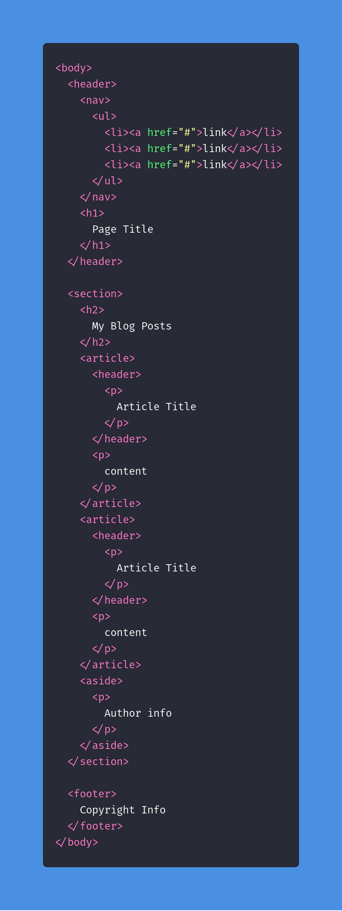
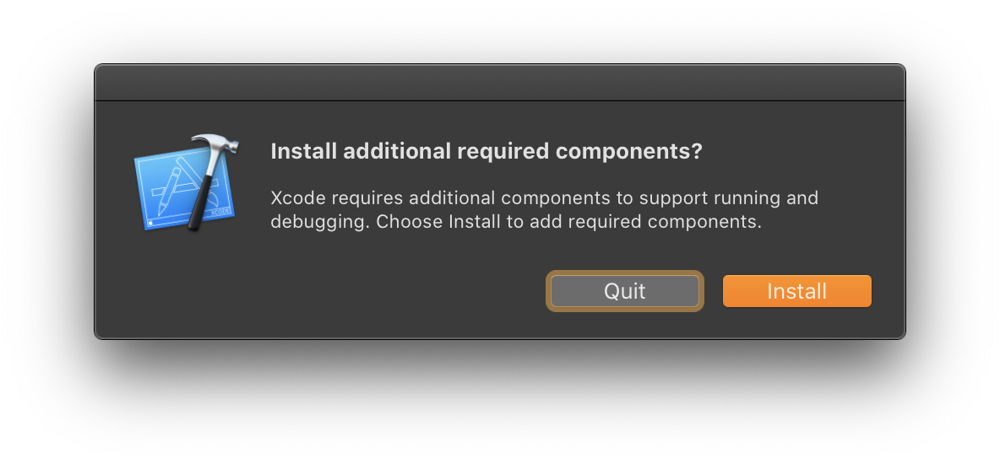
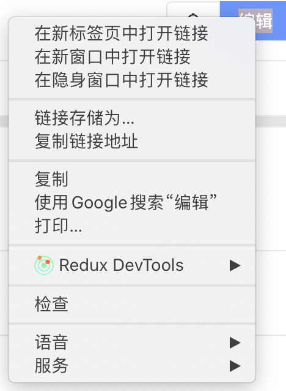
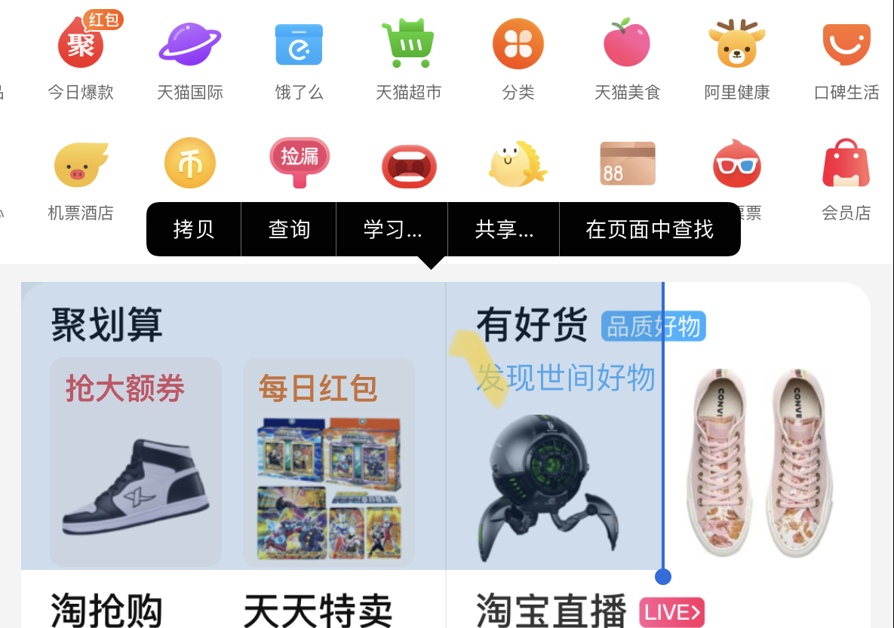
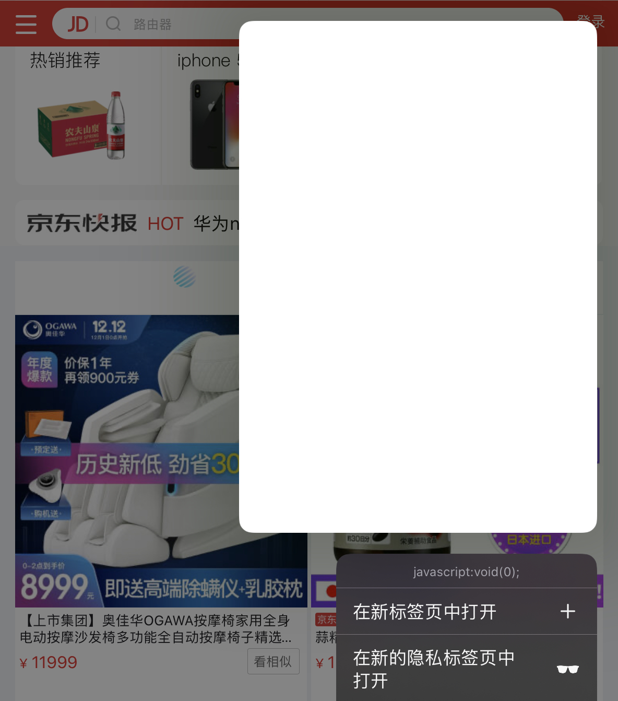

本文将会从下面 3 个点，来披露遵循 _a11y_ 的重要性和优点，不多就三个点。
1. _HTML_ 语义化
2. 合理的焦点
3. 快捷键

关于 `aria-` 类标签本文先不深入讨论，我们应该先慢慢地改变自己的习惯，先由 HTML 语义化更好的组织代码的层级结构。接着通过合理的焦点控制，让用户能够使用 Tab 来解放鼠标。接着再适当地注入快捷键，来进一步提升效率。而屏幕阅读器因为离我们目前还有点远，不需要为了强调 _a11y_ 的纯粹性而一口吃成一胖子。

## 选择更富有含义的标签来取代 div
随着 HTML5 的面世，我们有了非常多的标签选择的权利。[article](https://developer.mozilla.org/en-US/docs/Web/HTML/Element/article#Examples)，[section](https://developer.mozilla.org/en-US/docs/Web/HTML/Element/section)，[footer](https://developer.mozilla.org/en-US/docs/Web/HTML/Element/footer)，[header](https://developer.mozilla.org/en-US/docs/Web/HTML/Element/header)，[main](https://developer.mozilla.org/en-US/docs/Web/HTML/Element/main)，[nav](https://developer.mozilla.org/en-US/docs/Web/HTML/Element/nav)，[menu](https://developer.mozilla.org/en-US/docs/Web/HTML/Element/menu)，[aside](https://developer.mozilla.org/en-US/docs/Web/HTML/Element/aside)，h1-h6 等等都似乎象征着那些**冷冰冰**的 div 应该被淘汰。

当然，每一个标签都有它的使用场景，单纯地使用 `section` 来替代所有的 `div` 这并不是一个很好的使用姿势。尽管在编码之前要**斟酌**到底到底使用哪个标签似乎又是个让人很容易放弃的理由，与其思考**几分钟**用 `article` 还是 `section`，不如 `<div class=“container”>` 来得直接。
这确实没错，这也是前端开发者目前正在面临的困境。严重的依赖 _classname_，这让我们在 debug 的时候不得不瞪大眼睛看清它，而且也不能依赖相关工具帮我们生成更为可靠的 _Outline_。BTW，在 _React 16.2_ 之前没有 `Fragment` 存在的时候，多出了大量的 _bare div_，从而使 _React DevTool_ 调试的时候非常痛苦，剥开了一个 div 又是一个，何时才能到头 🙂

并不需要要求自己一开始就严格遵循规范或者所谓的[最佳实践](https://developer.mozilla.org/en-US/docs/Web/Guide/HTML/Using_HTML_sections_and_outlines)，本文也不会尝试说明 `nav` 在什么时候用，为什么它比 `div` 好多了，过于学院派只会让人讨厌。但是，有意的去调整，刻意地去练习，最终就会拥有一套自己选标签的标准。

但是感觉这两段代码谁更容易阅读，我相信结果是非常明确的。



## button，a 而不是 div
为什么程序员喜欢用 `div` 而不是 `button`？因为 `div` 没有任何 style，而 `button` 和 `a` 有，往往为了清理这些默认 style 你需要花额外的功夫。可是仅仅因为样式而丢弃语义，就有点类似你给一个 title 使用 `<p style={{fontSize: 24}}>标题</p>` 而不是直接采用 `<h1>标题</h1>`，因为你觉得 `h1` 自带的 `margin`，让你感到很心烦。
这里我们抛开语义不谈，使用 div 还会丢失三个特性：
1. 按下 Tab 键获取焦点的能力
2. _onClick_ 事件可以通过按下回车或者空格来触发（a 是按回车，button 两者都可以）
3. 没有 _disabled_（如果你通过 CSS 来模拟样式是不够，往往还需要 JS 来配合的）

这样的好处不言而喻，假设一个场景，你要删除某个 item，这个时候弹出了一个 pop confirm，来问你是否**确认删除**。换句话说，会有两个“按钮🔘”，一个是取消，一个是确定。如果它们仅仅是 `div` 的话，你就需要移动你的鼠标，去点击其中的取消或者删除。但是如果他们的开发者合理地选择了 `button`，再通过自动 focus 取消按钮，这样你只需要轻松地按下空格，就可以关闭 pop 了。或者按下 Tab 将焦点切到确定，然后按下空格**完成删除**，在整个过程中你不需要点击鼠标。

在大多数场景下，PC 用户似乎喜欢用鼠标来点，那些享受用快捷键的无非就是那些用着 _Vim_ 的异类罢了。这里不讨论出现这种斯德哥尔摩综合症的本质是什么，但是请记住，_a11y_ 的本质就是**服务任何人**。当用户意识到这个功能支持快捷键的时候，这就能为它带来幸福感。

再以 macOS 常见的 _Dialog_ 为例，下面是一个 Xcode 的场景。

你就能注意到，Quit 默认是被 focus 的，意味着按下空格就能直接退出，然后你可以按下 Tab 切换到 Install 去。此外 macOS 还有一个改进：你可以直接按下回车按触发 Primary Button，在这里就是我们橙色的按钮。

除了 `a` 和 `button`，`input`，`select`，`textarea` 等常见的标签也是能直接获得这些能力。参考 [Use semantic HTML for easy keyboard wins](https://web.dev/use-semantic-html/)

## Form 的问题
回到 Web 中，`alert` 和 `confirm` 这两个方法也是支持按下回车直接确认，按下 Esc 来取消。我们可能因为这两个 API 唤起的 Dialog 过于丑陋，而忽视了它在体验上的优势。

我身边的开发者很喜欢讲 Form 放在 Dialog 里，可是这也让 Form 变得非常难用。它 **不支持自动 focus 第一个控件**，也不支持按下回车（或者 ⌘+回车）提交，最大的慈善就是支持 Esc 关闭 Dialog 而已。想象下这种填写表单的体验是有多么的糟心吧！你要点下按钮唤起 Dialog，然后移动鼠标，再点击第一个 input（它们可能还不支持点击 label）。接着你只能祈祷，你可以一直按 Tab 来切到下一个控件而不需要继续操作鼠标，选择，并点击确认按钮。

表单本应该是一个和输入强关联的操作，但是我们却要频繁地使用鼠标去导航，去中断我们的思考。如果你没有感觉到这有多让人沮丧的话，这正说明你所用到的产品没有一个人在遵循这种规则，他们一直在浪费你的时间，而这就是罪恶。说实在的，我已经受够了唤起一个搜索窗口后，你还需要去点击里面的搜索框的日子。

那为什么要提到 ⌘ + 回车呢？因为如果你的表单中，存在多行文本，和 Button 的话，按回车提交就会和已有逻辑冲突了。不知道你有没有注意过，GitHub or Gitlab 的 comment 或者其他任何长文本编辑，就是支持 ⌘ + 回车提交的，这就是人文关怀！这种特殊性也意味着，我们不能仅仅通过下面这样的代码，来通吃所有的场景。

```jsx
<form onSubmit={submit}>
  {children}
  <button type=“button” onClick={cancel}>取消</button>
  <button type=“submit” onClick={submit}>确认</button>
</form>
```

我的建议还是写一个类似 `useKeydown` 的 hooks，通过 这种方式来灵活的调整。
```jsx
const keydown = useKeydown({
  enter: submit,
  esc: cancel,
  withMeta: true
}
<form onKeyDown={keydown}>
  {children}
  <button type=“button” onClick={cancel}>取消</button>
  <button type=“submit” onClick={submit}>确认</button>
</form>
```


## Button 和 a 的区别
关于使用 button 还是 a，看一个常见的的场景：
```jsx
<Button onClick={() => history.push(url)}>编辑</Button>

<Link to={url}>编辑</Button>
```

单单看这两行代码，我们会毫不犹豫的选择第二个，因为**它代码量少，不需要引入 history**。但是在实际使用中，`Link` 往往是不能达到要求的，因为它缺少了样式。
所以为了保证样式，你必须写成 `<Link className=“byte-btn byte-btn-primary byte-btn-size-default byte-btn-shape-square" to={url}>编辑</Link>`

在这个时候往往就会放弃使用 `Link` 而是直接采用更加“人文关怀”的 `Button`。

Ok，DRY 是一个程序员的基本素质，所以采用 Button 似乎也更为合理。但是这样会有什么缺陷呢？
这是你右键一个 _button_ 的效果

这是你右键一个 _a_ 的效果


区别就是：**通过 a，你可以新建一个窗口来进行编辑操作**。换句话说，你可以通过 ⌘ + Click 新建窗口，你可以选择任何时候在这个窗口编辑。
同样的，想象成这如果是一个 List，你希望打开这个 List Item 的详情，我们假设这个 Item 就是你在电商网站逛的时候的商品，你看到某个图片不错，但是还想继续逛，你会怎么做？显然是新建一个标签页，**稍后再看**。如果一个电商站点使用 SPA 来搭建，到处都是长得像 `a` 的 `button`，甚至是 `div`，你还会享受这个体验吗？
除此之外，屏幕阅读器对于 `a` 和 `button` 也是不同的对待，当然这个目前不在我们的讨论范围内。

既然我们已经知道了 `button` 和 `a` 的区别，那在使用 `a` 的时候希望获得 `button` 的样式，或者反过来的场景，最好的建议还是自己实现一个可复用的组件。在我的代码库中，有一个 `ButtonLink` 就是做这样的事情：一个长得像 Button 的 Link。

有没有什么通用的规则来指导使用 `button` 还是 `a`？我引用了 Google 工程师 [Rob Dodson](https://twitter.com/rob_dodson) 的看法。

> If clicking on the element will perform an _action_ on the page, use <button>.
> If clicking on the element will _navigate_ the user to a new page then use <a>. This includes single page web apps that load new content and update the URL using the  [History API](https://developer.mozilla.org/en-US/docs/Web/API/History) .

BTW：其实本质是一个 button。比如 `<a href=“javascript:void(0)” onClick={goHome}>home</a>`，这种场景都是应该避免的。具体原因我们在后面会看到一个例子。


## 针对库作者
3 个要点已经讲完了，普通开发者需要做的事情就是：打开 [eslint-plugin-jsx-a11y](https://www.npmjs.com/package/eslint-plugin-jsx-a11y), 刻意练习。而对于库的开发者，存在更多的不可确定性，因为他们在设计的时候会强调通用型。我们以 [Tag](https://ant.design/components/tag-cn/#components-tag-demo-checkable) 为例，看看 antd 的实现。这里关注的问题是，它是一个可交互的控件(`checked`)，但是 _DOM_ 结构上却是一个 `span`，也不支持 `tabindex`。可以理解开发者如果要根据不同的 _props_ 来渲染不同的标签显然大大提升了复杂度，而且可能还会引入意向不到的问题。

目前最主流的库的实现是通过 [as](https://reacttraining.com/reach-ui/menu-button#menulink-as) 或者 [component](https://material-ui.com/api/chip/)，来制定最外层节点的节点，并且在这个组件返回 Element 的时候，最外层要求是原生。比如这里的用法就能改成：`<Tag checked as=“button” type=“submit”>yes</Tag>` ，从而大大提升了灵活性。
虽然这种灵活性可能会导致组件设计时看上去很冗余，比如一个 [Dialog](https://material-ui.com/components/dialog) 你就需要 import 5 个 components，但是在我看来它是值得的。

值得一提的是，[@reachui](https://reacttraining.com/reach-ui/) 和 [@material-ui/core](https://material-ui.com/) 在 a11y 上做的特别好，相对来说，前者没什么样式，严格符合标准，甚至有点学术味。后者则显而易见的自带 Material UI 的风格，在动效的处理上非常生动。

## 移动端呢
上诉言论主要是基于我数年来都是在开发 PC，而并没有去了解过移动端。如果我们不考虑屏幕阅读器，又不需要用到键盘的时候，上面强调的观点是否还需要遵循的？如果你是一个响应式 app，这是肯定的。但是如果是个纯粹的移动端站点，比如某宝呢？首先，HTML 的语义还是需要继续维护的，这关乎着开发体验。

但更重要的还是 a 和 button 的使用，我们看两个例子：

第一张图就是典型的 div 场景，你以为它是个链接，想通过长按打开新 tab，但它们就是个文字而已。

第二张图就更搞笑了，大大的 `javascript:void(0)`，完全让普通消费者觉得莫名其妙。
同样的，如果是一个长得像 `button` 的控件，你却给它用了 `a`，那么长按后得到的反馈也让人莫名其妙。

焦点的问题其实在移动端也值得重视。你以为你点了搜索后，就能开始打字了？抱歉想多了，他们还是需要再点一次。

[登录的时候](https://s.m.taobao.com/h5?search-btn=&event_submit_do_new_search_auction=1&_input_charset=utf-8&topSearch=1&atype=b&searchfrom=1&action=home%3Aredirect_app_action&from=1) 也一样，好像鼠标比键盘更便宜就应该保护键盘似的。反观 [Github](https://github.com/login) 的[注册](https://github.com/join?source=login)，强烈的人文关怀。

所以综合来看，除了快捷键的加入需要根据平台来决定之外，其他都是必须遵守的规则。

## 总结
再次重复一下 a11y 是为了**服务任何人**，可能你不是 _VIM_ 用户，你更喜欢用鼠标点，但是这不意味着你就能抹杀另外一部分人的时间。这批人往往是专业用户，他们的评价也更能决定你这款产品的价值。
