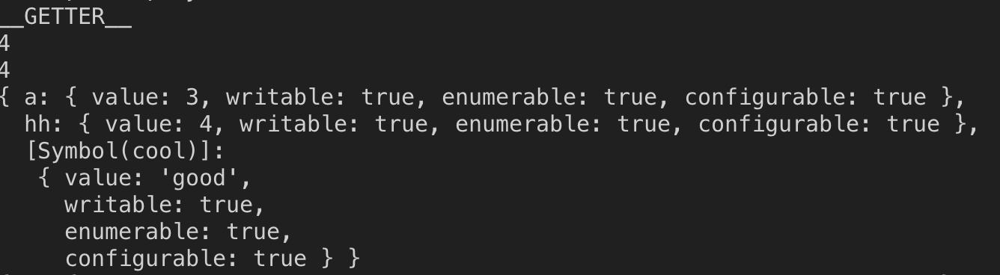
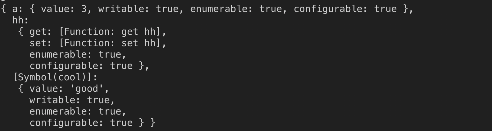

在 _immutable struct_ 或者说 _functional programming_ 的影响下, `Object.assign` 和 [Object Spread](https://github.com/tc39/proposal-object-rest-spread) 是我们离不开的操作. 不过它的功能真的是 _shadow copy_ 吗? 这里我列出一个例子来记录这个问题, 以防以后碰到坑.

下面是一个对象, 包括了几种典型的属性:

1. 普通属性
2. get 属性
3. set 属性
4. Symbol

```js
const obj = {
  a: 1,
  get hh() {
    console.log('__GETTER__');
    this.a += 1;
    return this.a;
  },
  set hh(val) {
    console.log('__SETTER__');
    this.a += val * 2;
  },
  [Symbol('cool')]: 'good',
};
```

先提出问题, 哪种类型的属性会被成功 copy? `get 和 set` 时候会被运行呢?

首先可以确定的是, 连续两次打印 `obj.hh` 的话, 一定会得到 `2, 3`. 因为每次 `hh` 都会被运行对吧.

OK, 现在开始对它 `assign`, 有下面代码

```js
const shadow = { ...obj };
console.log(shadow.hh);
console.log(shadow.hh);
```

这个时候得到的值是多少呢(假设这串代码紧接上面的代码)
最后的结果是 `4, 4`
这说明 GET 只被运行了一次后, 就再也没有运行了.
那我们打印一下 shadow 的内部看看,

```js
Object.getOwnPropertyDescriptors(shadow);
```



注意到, 这个时候 hh 只是一个普通的属性, 而不再属于 get set. 作为对比, 我们看下 obj 会输出什么.


所以结论就是, 普通属性和 Symbol 会被 Copy. 至于 Symbol 时候还是原来那个, 自己测试一下可以发现肯定是的.

那么, 另外一个问题. 这些 GET 和 SET 是在什么情况下被执行的呢? 我们可以看到, 上面只打印出了 **_GETTER_** 而没有 **_SETTER_**, 先引用 MDN 的文档

> The Object.assign() method only copies enumerable and own properties from a source object to a target object. It uses [[Get]] on the source and [[Set]] on the target, so it will invoke getters and setters.

也就是说, 第二个参数的 GET 会被调用, 第一个参数的 SET 会被调用. 而因为 `{ …obj }` 就相当于 `Object.assign({}, obj)`, 所以只有 GET 会被调用。

如何证明 SET 会被调用呢? 这个简单, 使用 `Object.assign(obj, obj)` 就行.
如果现在的代码是这样的

```js
const symbol = Symbol('cool');
const obj = {
  a: 1,
  get hh() {
    console.log('__GETTER__');
    this.a += 1;
    return this.a;
  },
  set hh(val) {
    console.log('__SETTER__');
    this.a += val * 2;
  },
  [symbol]: 'good',
};

console.log(obj.hh);
console.log(obj.hh);

const aha = Object.assign(obj, obj);
console.log(Object.getOwnPropertyDescriptors(obj));
console.log(Reflect.ownKeys(aha));
```

会出现下面的结果.


在这里, GET 和 SET 都被调用了一次, 分别是 source 和 target 调用的. 而这个时候 a 变成 12 也不难解释.
因为 `obj.a` 原来是 3. 当 assign 被调用的时候, 内部会有一个 `obj.a = obj.a` 的过程. 先 GET, 就让 `obj.a` 变成了 4, 然后是 SET, 也就是 `obj.a += obj.a * 4` 就成了 12.

不过, 值得注意的是, 这里 hh 还是 GET 和 SET, 并没有像上面的 assign 所做的一样，被替换成普通的属性.
不知道这是不是有意为之.

那么我们该如何复制含有 get 和 set 的对象呢? 如果用到 ES8 的特性的话, 会很简单

```js
const realShadow = Object.create(
  Object.getPrototypeOf(obj),
  Object.getOwnPropertyDescriptors(obj)
);
```



这里 a 的值还是 3, 说明这个 get 根本没有被执行, 完成没有副作用. 这才是真正的浅拷贝嘛!

OK, 那么这里可以得出一个结论: 对于普通的纯对象, 比如 redux 里保存的那些, 使用 `assign` 没有任何问题. 但如果是自己定义的复杂对象, 带了很多 get 的话, 最好的方式还是采用下面这种最安全的方式吧.

值得一提的是, 这也是 MDN 推荐的方式:

> Whereas the Object.assign() method will only copy enumerable and own properties from a source object to a target object, you are able to use this method and Object.create() for a shallow copy between two unknown objects

```js
Object.create(
  Object.getPrototypeOf(obj),
  Object.getOwnPropertyDescriptors(obj)
);
```
