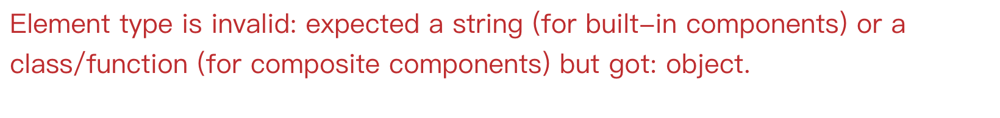

---

title: Element 和 Component 的区别
date: "2018-01-14T12:12Z"
---

本文的出现离不开 Dan 的一篇卓越的 blog。
[原文章](https://reactjs.org/blog/2015/12/18/react-components-elements-and-instances.html)

一句话概括就是，`Element` 是 `Component` 的返回值.
Element 其实就是一个纯对象，这个对象定义了一些对于 React 来说很重要的属性.
比如 `type，children，props，key，type` 这些的。举个实际的例子

```js
{
	$$typeof: Symbol(react.element),
	type: 'button',
	key: null,
	ref: null,
	props: {
		className: 'button button-blue',
		children: {
		type: 'b',
		props: {
        children: 'OK!'
      }
    }
  }
}
```

上面的 type 就是这个 Element 的核心之一。React 通过判断 type 是字符串还是函数来决定如何构造并 `mount` 这个 Element。如果是字符串就说明是普通 DOM，称为 `DOM Component`，如果是 `function` 就是自己定义的，称为 `CompositeComponent`。

创建组件的常用方法有两种，一种是纯函数组件，或者说 `stateless Component`

```jsx
const Button = ({ color, text }) => (
  <button style={{ background: color }}>{text}</button>
)
```

通过这种方式创建, 它的返回值就是定义了一个 Element。
直接使用 `<Button {...props} />` 就能得到我们定义的 Element。
不过这仅仅是因为 JSX 给了我们一种语法糖，如果没有 JSX 的话，应该类似于

```js
React.createElement('button', { style: { background: color } }, text)
```

而这个函数的作用也仅仅只是生成一个**对象而已**，就像最上面那个对象一样：

```js
{
	type: 'button',
	props: {
		style: { background: color },
		children: {
			…
		}
	}
}
```

这就是 Element 的真面目了。所以可以看到，JSX 也好，`createElement` 也好，不过是提供一种抽象帮我们不要写这个无聊的对象定义，要知道，如果再多几个 children 的话，整个对象定义应该就有几十行(当然，这个对象还会有其他作用，这里不展开)

同样的，如果换成 `Stateful Component` 的话，其实模式差不多。
只不过，它们需要一个 `render` 方法，并且拥有一个被称为 `instance` 的变量。render 的目的就是定义一个 Element，而 instance 就是 在 render 中使用的 `this` 了。

所以，一个 Element 出现的步骤此时是，

```js
const instance = new type(props) // type 就是该组件的 type
const Element = instance.render() // render 不就是 React.Component.prototype 的方法吗
```

综上所述，我们最常写的是 Component，Component 分为三种：

1. host（常见 DOM 节点）
2. function
3. class

host 类型，React 会根据对应 type，生成真正的 DOM node，并将它所带的 props 写入 node 的 `attribute` 中，而对 `children` 继续递归，直到碰到没有 children 的 host Element 为止。

Function 的返回值是 Element, class 的 render 函数的返回值是 Element

不过这里还有一个问题，function 和 class 的 `typeof` 都是 `function`，这两个是怎么判断的呢？
因为 class 定义的组件，继承于 `React.Component`，它拥有一个特定属性，只需要检测是否拥有这个属性就能确定是 class 还是 function。


## 一个常见问题

假设有下面的两个变量

```jsx
const E = <p>Wow</p>
const C = () => E
```

这两个的区别是什么呢？刚开始很容易写出这样的代码

```jsx
render() {
	return (
	  <div><E/><div>
	);
}
```

但是如果真这样写的话，铁定是会报错的。

于是我又发现可以这样写

```jsx
render() {
	return (
	  <div>{E}</div>
	);
}
```

那么为什么上面一种可以下面不可呢？

首先，分析一下上面报错的原因，根据上面说的，我们知道，`<E />` 就是一个语法糖，也就是 `React.createElement(type, props, children)`

其中 type 就是 E。那么，根据我们的定义 E 也是一个 `React.createElement('p', {}, '123')` 这样的表达式，其实就是一个对象。
显然这个时候 `<E/>` 得到的值，其实是一个对象！！ 而 React 内部是通过 type 属于 string 来确定这是 host Element，type 属于 function/class 来判断这是一个组件。因为此时 type 是一个对象，自然就会报错。

而，`{E}` 为什么可以呢？还记得我们最常在 `{}` 中写什么吗？

```jsx
{
  this.props.names.map(name => <li key={name.id}>{name}</li>)
}
```

这里表达式最后就是一个 `Array of Element`，显然这样是合法。所以，总结过来可以发现一个规律，

> `<A />` 整个表达式是一个 Element，而 A 是一个 Component， Component 要么是 function（class 也是 function），要么是纯 DOM
