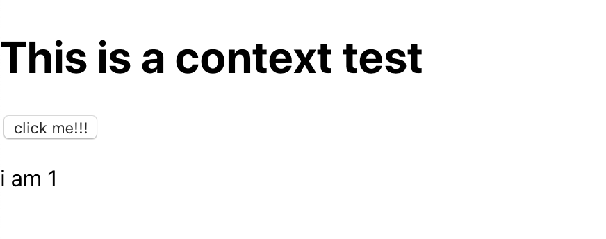

收集一些不为人所知的，React 的细节问题。帮助自己理顺 React 内部深层的逻辑。

# Context 的更新，会更新 ✨ Provider ➡️ Consumer 之间所有的组件么

这个问题提出来的依据主要是，`setState` 在 React 中是会**一定会带来更新的**，除非设置了 `memo` 或者 `shouldComponentUpdate` 这些优化措施。换句话说，一般情况下，每次 Context 中 value 的更新，必定伴随着一个 setState 的过程。而这个过程必定导致含有 `<Context.Provider>` 的组件往下更新，也就让我们无法观察到这个过程的更进一步的细节。

如果想要探究这个问题的话，需要三个组件，分别被称为 App, Foo, Bar。
App 就是父组件，它的 `render` 中就返回了包含 Provider 的代码。
Foo 组件这是这个 Context 的消费者，它通过 Provider 拿到对应的展示内容。
Bar 则是两个组件中的中间层，它的作用就是承接 Foo 和 App。同时它的 `shouldComponentUpdate` 会设置为 **false**。

借助 Hooks，有下面的实验 🧪 代码。

```jsx{11}
import React, { useContext, memo, useState, useCallback } from 'react';

const FooContext = React.createContext(1);

const Foo = () => {
  const foo = useContext(FooContext);
  console.count('foo');

  return <p>i am {foo}</p>;
};
const Bar = memo(() => {
  console.count('bar');
  return <Foo />;
});

const App = () => {
  const [value, setValue] = useState(1);
  const addValue = useCallback(() => setValue(value + 1));

  return (
    <>
      <h1>This is a context test</h1>
      <button onClick={addValue}>click me!!!</button>
      <FooContext.Provider value={value}>
        <Bar />
      </FooContext.Provider>
    </>
  );
};
```

界面很 简单

通过点击 _click me_ 那个 button，就能看到 /i am / 的变化。同时注意 Foo 和 Bar 中都有一个 `console.count` 用来观察这个组件是否重新渲染。
最后得到的结果就是，**foo 会随然每次点击都打印，而 bar 不会**。而如果将 memo 移除的话，每次 bar 也会被打印出来了。

最后结论就是：**Provider 的更新不会带动 Consumer 之间的组件更新**。

## 随便一提

当然，其实这个问题通过推断就能得到结果的。因为新的 Context 带来的一个重要特性就是**即使 shouldComponentUpdate 返回 false，子组件也会被更新。**

如果我们把上面的 Foo 和 Bar 合成一个

```jsx{3,4}
const Bar = memo(() => {
  console.count('bar');
  const foo = useContext(FooContext);
  return <p>i am {foo}</p>;
});
```

也是一样的效果。
