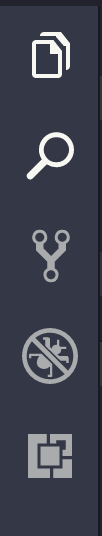
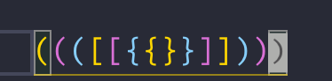
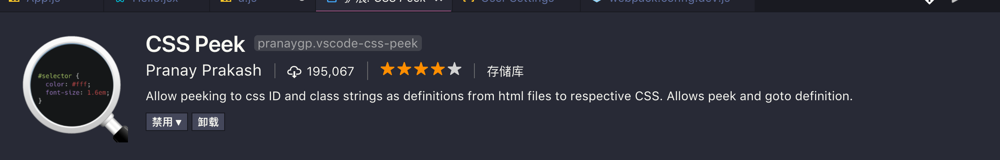

这篇文章主要是针对打算学习前端的小白，和想学点前端的后端大佬，为了提升你们的编码幸福感。

> 工欲善其功，必先利其器

简单介绍下背景，VSCode 是目前前端界最为流行的一款**编辑器**，每月一次的更新，强大的插件生态和 TypeScript 的整合，让这款编辑器瞬间风靡世界。像之前的 Sublime 和 GitHub 的 Atom，都无法与它抗衡。比如 [Vue](https://vuejs.org) 的作者 Evan You 也是用它作为主力开发工具。

## 准备工作

第一步当然是下载 [VSCode](https://code.visualstudio.com/) 并安装。Window 用户印象中还需要下载一个 Git 的工具，无论你知不知道的 Git，以及 Git 和 GitHub 的区别，反正去[官网](https://git-scm.com/) 下载好这个并安装。如果你在终端（命令行）中输入

```bash
git --version
```

会有一个版本号输出的话，就说明下载成功了。

Mac 用户只要安装过 Xcode 或者开发者工具套件的话，就内置了 Git 的功能。之所以要安装 git 是因为 VS Code 的插件基于 Git 的支持。

接着还需要安装，[node](nodejs.org)，[yarn](https://yarnpkg.com/lang/en/) 英文不好的同学也不要管那么多，看到 **Install, Download** 这种单词就点，下版本最高的就行。Window 用户的 node 需要下载的是一个 `.msi` 文件不是 `.exe` 文件，`msi` 文件能给 Window 环境写入一个二进制文件，而 `exe` 仅仅是一个 node 的 REPL 环境。

> 因为作者本人对 Window 不够熟悉，很多描述是靠之前碰到过的坑，如果碰到问题的话，还请自己使用搜索引擎解决

还是和之前一样，输入几个命令测试是否安装成功。

```bash
node -v
yarn why
```

在这两个都确定安装好后，继续输入

```bash
yarn global add eslint
```

Window 用户如果 Yarn 没有安装成功的话，就使用 npm 安装作为 B 计划

```bash
npm install -g eslint
```

安装好后，就会有打印出安装成功的 eslint 版本。[eslint](http://eslint.cn/) 是一个 JS 的静态分析器，它可以解决一些写 JS 经常遇到的问题：

1.  变量名写错了，但是没有报错。
2.  自己不想写分号，让它自动加
3.  强制要求格式的规范
4.  等等

还有 [TypeScript](https://www.typescriptlang.org/) 这是微软开发的一个 JS 超集，安装它的目的主要是它能够为 VS Code 赋予更强的能力，让开发更爽。设置里面会有很多功能性开关，需要安装了指定版本的 typescript 才可以，所以我们安装最新的就是了。

```bash
yarn global add typescript
// or
npm install -g typescript
```

和上面一样，如果 yarn 没安装成功的话就是用 npm。在本文写作的时候，typescript 的版本为 `2.9.1`
接下来就进入 VSCode 的流程。

## 安装插件

最基本的 VSCode 的侧边栏有五项

其中第五个就是安装插件的一个 Tab，点开来，选择常用的拓展，就能看到根据安装量排序的拓展工具。

如果真的想要好好运用 VSCode 的话，还是要自己多花费点时间在这些拓展上，找出几个真正适合你的。

---

先看看，需要配置的插件

### ESLint

现在没有 ESLint 已经没法写 JS 代码了，我们不需要花太多时间在找自己的拼写错误导致的 bug 上。下载 VSCode 的 ESLint 插件后，重载 VSCode，打开设置，搜索 _eslint_。

这里主要需要修改的几个配置。

* `eslint.autoFixOnSave`
* `eslint.packageManager`

  其中第一个设置是可以在每次保存的时候，自动修复一些**能自动修复**的错误，比如少了分号，缩进不对等等… 注意 VSCode 的设置不能直接修改，需要复制到右边的用户设置区，来修改。通过点击左侧的那个 edit 图标就能复制到右侧，接着修改后再保存就能生效。
  
  第二个设置是根据你使用 yarn 还是 npm 安装 eslint 来确定的。如果使用的是 yarn，就改成 yarn；npm 保存不变。

eslint 通过一个**规则文件**驱动，可以叫做 `.eslintrc, .eslintrc.json, .eslintrc.js` 等等，刚开始的时候，你可能不知道 eslint 有哪些规则，这该怎么办？我们可以使用 eslint 默认的设置，来入门。

```bash
eslint --init
```

接着会需要你回答一些和偏好有关的问题

```bash
How would you like to configure ESLint?
> Answer questions about your style
  Use a popular style guide
  Inspect your JavaScript file(s)
```

类似于这样的问题。用方向键控制，回车来确定。最简单的方式是：

1.  Answer questions about your style
2.  y
3.  y
4.  这个问题是根据你是在浏览器还是在 node 上
5.  这个问题是问你是否使用 CommonJS，如果不写 node 的话，选择 N
6.  Do you use JSX? 写 React 的话，就选 y
7.  Spaces
8.  Single
9.  根据电脑系统选择换行的组成。LF/CRLF
10. y
11. JSON
    根据我这个配置会生成如下配置代码

```json
{
  "env": {
    "browser": true,
    "es6": true
  },
  "extends": "eslint:recommended",
  "parserOptions": {
    "sourceType": "module"
  },
  "rules": {
    "indent": ["error", 4],
    "linebreak-style": ["error", "unix"],
    "quotes": ["error", "single"],
    "semi": ["error", "always"]
  }
}
```

注意 `indent` 这个 key，根据你的偏好来调整数字。4 表示的是 4 个空格。接着根据这个配置文件，eslint 就能发挥作用了。

像我这个代码就有很多波浪线出现，就是因为 eslint 在抗议了。第一个错误和第三个错误是因为我们在设置的时候没有选择 `commonJS` 导致的。`console.log` 下面会有波浪线是因为 `eslint:recommended` 的默认配置里，包含了一个选项
`no-console: error`，意思就是语句中不能出现 `console`，否则就是 error（error 还是 warn 决定了能够成功编译文件，出现了 error 就不行）。调整的方法也很简单，在 `rules` 中添加一句 `no-console: 'off'` 来覆盖这个设置就行。

### Code Runner


这个插件的功能是通过调用的系统的二进制文件，来直接运行代码，类似于 IDE 中的编译运行。不过在真正使用之前还需要稍微配置一下，在用户设置中搜索，`code-runner`，可以看到搜索出来的结果。

有很多的配置，可能很让人头大，但是先别慌，找几个我们要用的就行。

* `clearPreviousOutPut`
* `runInTerminal`
* `saveFileBeforeRun` or `saveAllFilesBeforeRun`

第一个的意思就是每次运行会清楚之前的输入，看个人喜好吧，我是觉得清楚一下会更好。第二个就是在自己系统的终端中运行这个，好处是可以直接打通我们**心爱的终端**，而且如果不配置这个的话，Window 会出现一些奇怪的问题，强烈推荐。

第三个的意思是，运行之前保存当前文件和运行之前保存所有文件，自己选择一个设置为 True 就行。为什么需要这个？因为我们经常会写完代码就去运行，但是发现自己忘记保存了，结果还是之前的结果。运行 JS 就是通过 node 来实现的，在我们安装后这个插件并重启后，新建一个 js 文件。像我下面是一个生成 HTML 模板的代码, 输入进去后

```js
const template = (title, content) => `
  <section>
	<h1>${title}</h1>
	<article>${content}</article>
  </section>
`;

const config = [
  { title: 'I can run js', article: 'Very Cool!' },
  { title: 'I can run everything', article: 'Really Cool!' },
];

const theHtml = config
  .map(({ title, content }) => template(title, content))
  .join('\n');

console.log(theHtml);
```

之后点击右上角的的这个播放键

就能看到 `console.log` 的结果被打印出来。


Code Runner 不仅仅支持 JS，我们需要这个功能可能是为了学习新语法，也可能是测试某个算法。

### Prettier

这个是最近一年最火的格式化工具，能够将你写成 💩 一样的 JS 也能格式成十分漂亮的代码（前提是没有语法没错）。同时也支持 HTML，CSS，JSON，Markdown 等等文件。

为了体现它的强大，我们需要去改一些配置。和之前一样，在设置中搜索 `format`，找到

* `editor.foramtOnPaste`
* `editor.formatOnSave`
* `editor.formatOnType`

解释已经有中文了，全部设置为 true 就行。至于设置这个功能的效果，不好仅仅通过文字来描述，但是我的博客又不支持 Video，所以这些只有由你们自己去尝试了。**写一点缩进比较烂的代码，接着保存，所有的代码就被格式化了。**

---

不需要配置的插件

### Bracket Pair Colorizer

如果仅仅看它的介绍的话，这个插件是一个会将你的 `([{}])` 这些使用不同的颜色区分出来，提升鉴别度。

可以看到这些括号都是彩色的。当然如果仅仅只是这么一个花哨的功能的话，当然不能提升什么编码幸福感。其实我最看重的是它的**作用域语句高亮功能**，嗯这个名字是我乱取的。就像这样：

注意到了吗，这对 `[]` 之间是一条折线，来表明这个括号所表示的作用域。这个功能在较长代码和嵌套的时候，特别有用。

### Auto Close Tag


这个不解释了，就是自动帮你填充对应的 Tag。如果你对 emmet 用的很熟练的话，这个插件可能出场率不高。

### Auto Rename Tag


和上面一个算是兄弟插件吧。嗯，作者也是同一个人。作用很明显，自动帮你改对应的 tag！同样的，如果你的结构比较复杂的话，这个还是会有点小 bug 的话，不过在时间的节省上，这个插件显然是必装的。

### HTML CSS Support


刚写前端的时候，或者为了方便，我们偶尔会把 CSS 写在 HTML 里，但是那样的话是没有直接创建 `.css` 文件强大的自动补全特性的，这个插件让一切都回来了。

### Settings Sync


同步你在 VSCode 中的所有设置和下载过的插件，Snippet，快捷键绑定。对于有多台电脑的情况下，这个插件是必备的。不过它理是基于 **gist** 保存的，而这个在国内需要翻墙… 同时这个插件第一次设置的也比较繁琐，需要一定的耐心。总的来说，当你必须换一台电脑的时候，一定要花点时间到这个插件上。可以节省你大量的时间！

### Path Intellisense


提供 URL 的自动补全功能，这个必须装吧。支持任何语言，触发条件一般是在一对引号中，输入 `./` ，`../`, `/` 这些表示路径的前缀，就会跳出来了。像我们的 JS，HTML 中引用文件，CSS 中 `url` 就再也不用担心了。


### CSS Peak



这插件的功能就是在我们看到 HTML 或者 JSX 等代码中，如果出现了 `class/className` 的话，可以通过 `Cmd/Ctrl` ➕ 左键点击某个 class 直接跳转到对应 CSS 的定义。非常方便，但是**并不是每个时候都有用**

### Live Server


这是一个神器，如果你还不会使用 `webpack 或者 parcel` 的话。它提供了自动保存文件后自动刷新的功能。虽然这个功能看上去并不是很起眼，和 `browser-sync` 似乎也差不多，但它能内置到 VSCode 中就大大简化了操作。

对于刚写前端的朋友有一个很重要的问题，他们往往喜欢直接通过浏览器打开某个 HTML 文件，在浏览器顶部会显示这个 URL 是 **file** 开头的。file 也算是一个协议，和我们知道的 HTTP 协议一样。如果直接通过 file 来打开 HTML 的话，很多 JS 的功能是不能实现的。比如：

1.  Web Worker
2.  Service Worker
3.  `<script type="module" src=""></script>`

所以使用这个插件，就再也不用担心这个问题。使用方式也很简单，安装好后，点击需要的启动的 HTML 文件中底部 tab 的


在短暂的等待后，就会自动打开你的默认浏览器跳入由该插件启动的服务器。


下次要进去的话，可以直接通过 `localhost:5500`进去。值得一提的是，这个插件仅仅只是一个很方便的功能，但不代表它很强大。需要更强大的开发流程还是需要考虑 parcel 或者 webpack。

## 更多

如果还想继续提升开发的幸福感，可以考虑学习

1.  [Emmet](https://emmet.io)
2.  [VSCode 文档](https://code.visualstudio.com/docs/editor/codebasics)

谢谢阅读 🌚
